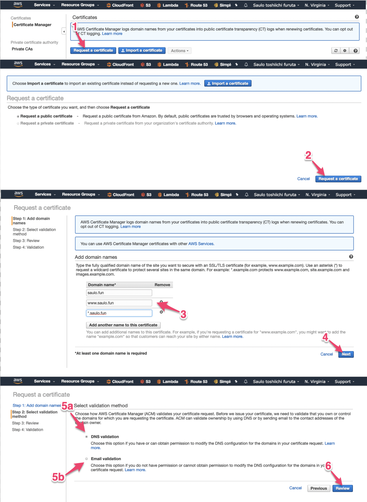
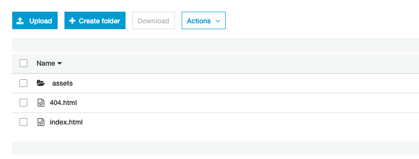

# Build your portfolio under your domain

## What's next?
Let's show the world the things you create!

Part of the fun in coding is showing the world what you believe to be useful ([JSON prettify](https://codebeautify.org/jsonviewer)) or just fun ([puddin](http://www.pudim.com.br/), [birthday-js](https://nullprogram.com/birthday-js/?1993-12-4)). It amazes me how creative and light-spirited our generation of devs are.

That's why, a lot of services exist today just to easy this type of flow, from code to production with the least friction possible!

[https://app.netlify.com/](https://app.netlify.com/)

[https://surge.sh/](https://surge.sh/)

[https://pages.github.com/](https://pages.github.com/)

As much as I love the practical usage of those kinds of services, the other part of the fun in coding is learning**.** Ever wondered how to get from buying a domain, to actually having an app under it? Wanna know the practical difference between [`www.yourdomain.com`](http://www.yourdomain.com) and `yourdomain.com`? We will also take one step further and secure our website with HTTPS (powered by AWS) and even set up an email under the domain! Impress your friends by sending them a `hello` in your new email!

Buying a domain and using AWS  may cost a couple of bucks... And if you don't know AWS, that's an excellent side-project to work on to get started!

note: It's possible to set alarms in AWS billing settings so it notifies you when you're reaching your limit. It's a good idea to set a limit like USD 2.00 in case you accidentally expose your KEYS and hackers start mining bitcoins with your money

## So, what's the plan?

- Buy a domain
- Email configuration with least effort possible so we can get our https certificate from it
- Emit certificate (HTTPS) under ACM (Amazon Certificate Manager) to your domain
- Prepare a location (S3) to host our app static files
- Configure a CDN (CloudFront) to propagate your bucket files through the edges of the world (optional but recommended!)

### Domain

Let's buy a domain from whatever `domain names registrar` you want (N[amecheap](https://namecheap.com), [domain.com](https://www.domain.com/), [for BRs out there](https://br.godaddy.com/), [FREE ALTERNATIVE](https://www.freenom.com/)). I'll be using Namecheap to set things up, but the concepts are the same, so no worries if you bought that sweet domain in a promotion from another registrar.

- Tip: Want a FREE domain and with EMOJI? Follow this guide: [https://dev.to/bauripalash/how-can-you-get-your-own-emoji-domain-for-free-5e9c](https://dev.to/bauripalash/how-can-you-get-your-own-emoji-domain-for-free-5e9c)


### Request a certificate for HTTPS

If you don't have a AWS account, go ahead and create one! Then, go to [AWS Console](https://console.aws.amazon.com/) and find the Certificate Manager Service.


Click on 1 then search for certificate under 2

Under the services menu, search for the `Certificate Manager`



Step number 3 is where you can request the certificate for your [FQDN](https://en.wikipedia.org/wiki/Fully_qualified_domain_name), so you can either place a specific domain to be "certificated" (like `very.saulo.fun`) or a wildcard (`*.saulo.fun`). Don't forget to add the `saulo.fun` because the wildcard won't catch it.

In step 5 you have to choose.

In 5a  you won't need to create an email to validate the certificate but can only choose this option if you have access to the domain configuration (for example, Namecheap > dashboard) because you'll have to set a CNAME record.  [Read here](https://docs.aws.amazon.com/acm/latest/userguide/gs-acm-validate-dns.html) the advantages over email validation

in  5b, you'll have to set an email for your recently bought email, so we'll have a few options:

- Use AWS Simple Email Service (SES). Your email can go directly to a S3 Bucket ([more here](https://medium.com/@sbuckpesch/setup-aws-s3-static-website-hosting-using-ssl-acm-34d41d32e394)) or a more definite solution to use a lambda to forward you email to an existing one.
- Redirect your email using the redirect from [namecheap](https://benjamincongdon.me/blog/2017/06/13/How-to-Deploy-a-Secure-Static-Site-to-AWS-with-S3-and-CloudFront/) or another one like ([https://improvmx.com/](https://improvmx.com/))

**Option 5.a  - DNS Validation**


Step 1 - Click in the row to open more details.
Step 2 - Download the file with the CNAMEs for all FQDN

After requesting in AWS, you must [add the CNAME record in Namecheap](https://documentation.unbounce.com/hc/en-us/articles/203687394-Setting-Up-Your-CNAME-with-NameCheap).


Step 1 - In your dashboard, select the "Domain List"
Step 2 - Manage the desired domain


Step 1 - Add a new Record

Look how interesting! There are already some records set for you by Namecheap, lets understand them.

Some useful links to understanding DNS:
[https://www.youtube.com/watch?v=72snZctFFtA](https://www.youtube.com/watch?v=72snZctFFtA)
[https://www.namecheap.com/support/knowledgebase/article.aspx/9604/2237/types-of-domain-redirects--301-302-url-redirects-url-frame-and-cname](https://www.namecheap.com/support/knowledgebase/article.aspx/9604/2237/types-of-domain-redirects--301-302-url-redirects-url-frame-and-cname)

[https://www.cloudwards.net/what-are-dns-records/](https://www.cloudwards.net/what-are-dns-records/)

Lets first see the URL Redirect Record that takes the naked domain ("@" means "saulo.fun") and redirects to [`http://www.saulo.fun/`](http://www.saulo.fun/)

The URL Redirect Record do a 302 when trying to reach `saulo.fun` and redirect to `http://www.saulo.fun` but, when trying to reach the `www.` subdomain, because of the `CNAME` configuration, Namecheap nameservers will resolve (not redirect!) the address to another domain, in this case, `parkingpage.namecheap.com`, and the nameservers will continue resolving till it reaches the final destination that returns an HTML page.

Why Namecheap is not using a CNAME record from your naked domain to the parking page? Well, this [article](https://www.namecheap.com/support/knowledgebase/article.aspx/9604/2237/types-of-domain-redirects--301-302-url-redirects-url-frame-and-cname) explains that making a CNAME to resolve your naked domain might mess with others records such as TXT or MX. if you mess with the latter, you won't be able to use your domain in your email service, so be careful when following wrongly tutorials all over the internet (like I do sometimes 🤓).

Now lets add the CNAME records that resolves a bizarre subdomain to another subdomain that AWS trusts, so ACM knows this domain is ours to manipulate.


Step 1 - Note the highlighted name-value pair.
NOTE - if your are using Namecheap, the name is without the domain name! only the subdomain value


Step 1,2 - Remember to save this records.
NOTE - Again, see how its written www not www.saulo.fun. Only copy the subdomain in the Host column.

After save, it might take some time to DNS to propagate properly.

You can verify DSN propagation here [https://www.whatsmydns.net](https://www.whatsmydns.net/#MX/saulo.fun) (yer another useful tool)

Skip Email Validation if you choose this approach.

### Email Validation

If you chose email validation, lets configure a minimum email forward so we can receive the validation email for our domain. Or choose a [harder path](https://medium.com/@ashan.fernando/forwarding-emails-to-your-inbox-using-amazon-ses-2d261d60e417)


Step 2 -  Put a valid email that will receive all emails from @you.domain (admin@saulo.fun emails will go to myemail@gmail.com). For our case, you can add a simple forwarder  from admin@saulo.fun → myemail@gmail.com. The validation email will be sent to admin,  adminstrator, webmaster, postmaster and hostmaster, so you'll get spammed with validation emails.

If your registrar does not offer the redirect email feature, no worries, lets use another free email service. Let's use [https://improvmx.com](https://improvmx.com/).


Register your domain


Step 1 - Add the admin@saulo.fun or * (to catch all, remember?)
Step 2 - Your email


Step 1 - Select CustomMX
Step 3 - Add exactly those 2 "@ 10 mx1.improvm.com." and "@ 20 mx2.improvmx.com."

When you are done, the dashboard in [improvmx.com](http://improvmx.com) will stay green :)

Now, go back to AWS - ACM and Resend validation email.


And you are done!  Check your email to validate the certificate. Now let's host a REAL and SECURE web page!

### Create a S3 bucket and manually deploy your index.html

If you're still following me, good, we are half way there! S3 is a great place to store files like logs and images, why not my whole website?


The bucket name must be the url you want to access to get the website. I want my website to be under `www.saulo.fun`

Do a next next next, accepting the default settings, because we are properly configuring it next.

First let's do our first manual deploy! Let's upload some files (a.k.a. our app) to the bucket. You can go to any create-react-app and just run a `yarn build`, copy everything under `build` directory and upload to the created S3 Bucket.

It should look something like this:



Now, we will set this bucket to be used as a website hosting


Add index.html as your main index document!

Then click the endpoint above, and take a FORBIDDEN to the face 😱

Relax! Remember those permissions we neglected before? We need to open all gates of protection for this bucket, so the whole internet can have access to it. Are you scared of your files being publicly available to the internet? Just don't upload, alongside your project, any ~~nudes.jpg~~  sensitive information and you are fine (like a .env file).


I'll detail this step-by-step. Under the permissions tab, copy this permission:

```json
{
  "Version":"2012-10-17",
  "Statement":[
    {
      "Sid":"OpenTheGatesToTheInternet",
      "Effect":"Allow",
      "Principal": "*",
      "Action":["s3:GetObject"],
      "Resource":["arn:aws:s3:::www.saulo.fun/*"]
    }
  ]
}
```

And in step - 3, remember to update your Resource name with your bucket name.

Step - 4, try to save and fail miserably with Step - 5 error :)

Relax, it's just Amazon trying to protect you from, well, yourself. Lets try to understand what we are doing. A policy in AWS terms is a configuration that can allow or prohibit certain actions. In this policy of ours, for example, we are trying to:

**what this policy will do?** Allow**;**

**who? * (**star, meaning EVERYONE, but you could choose only yourself or a group of users**);**

 **what specifically?**  Get Objects (files) from S3;

**What things/files are we talking about?** everything (*) under the www.saulo.fun bucket.

Ok, so we need to loosen the gates before we can open.


In Public access (1) settings, click edit(2).

There are 2 locks here. Step - 3 will block Public bucket policies and unchecking this option will make it possible to save our "open the gates" policy,  instead of taking an "Access denied" to the face.

But it's not enough. We also must (Step - 4) uncheck this other block so users besides AWS and the owner can also access the bucket objects (files).

Go ahead and now save the policy again. It's kinda dangerous to set a public policy (when you are not hosting a website) so Amazon even puts an ugly badge to warns us that this bucket is public.


So now you can access you website with the given ugly domain! Or we can use what we learned about DNS and just add a CNAME record for www to resolve to this domain, so users accessing `www.saulo.fun` will result in the S3 page!

Remove http:// and any /  in Step -1


Again,  you can check the DNS propagation with this awesome app:

[https://www.whatsmydns.net/#CNAME/www.saulo.fun](https://www.whatsmydns.net/#CNAME/www.saulo.fun)

That's it, you have a unsecured website! Time to add the Certificate we fought so much to get.

### Using Cloudfront to speed up page delivery and securing it.

I did not found a way to add a certificate to a S3 Bucket. It seems we can only do it to Cloudfront and Elastic Load Balancer services.


Select the S3 bucket we just create (www.saulo.fun)


Optional, but since @ is still redirecting to http:// in Namecheap, lets redirect HTTP to HTTPS


Select the validated Certificate


After a while, Cloudfront will set things up (automagically) and  will give us a new domain to access S3. We can still access the unsafe HTTP domain from before.

We've been here before right? Lets make our domain resolve to the Cloudfront generated domain! Add a CNAME record from www → 123[bleus.cloudfront.net](http://de65aowrkj069.cloudfront.net/).

And it's done!

### FAQ

[https://medium.com/@graysonhicks/how-to-serve-gzipped-js-and-css-from-aws-s3-211b1e86d1cd](https://medium.com/@graysonhicks/how-to-serve-gzipped-js-and-css-from-aws-s3-211b1e86d1cd)


## Resources

[https://medium.freecodecamp.org/how-to-host-a-website-on-s3-without-getting-lost-in-the-sea-e2b82aa6cd38](https://medium.freecodecamp.org/how-to-host-a-website-on-s3-without-getting-lost-in-the-sea-e2b82aa6cd38)
