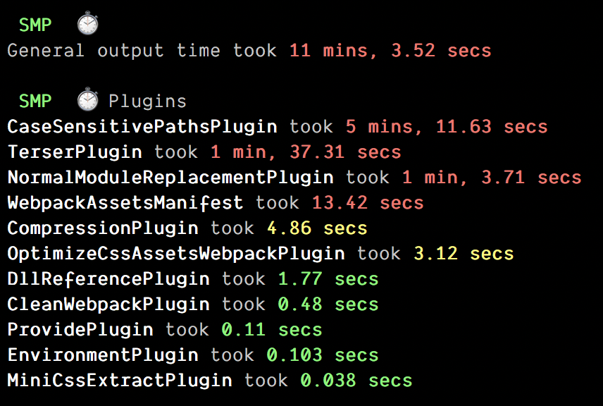
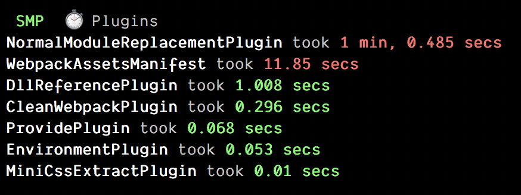
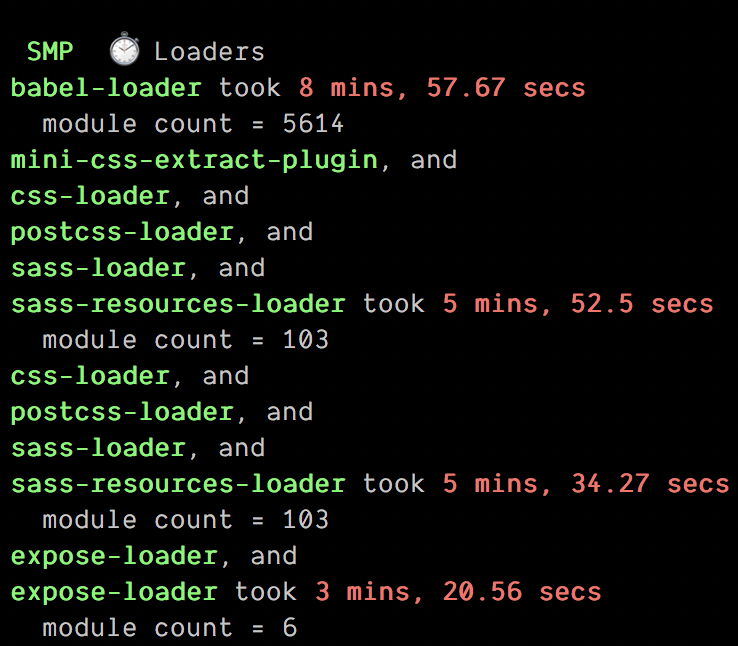
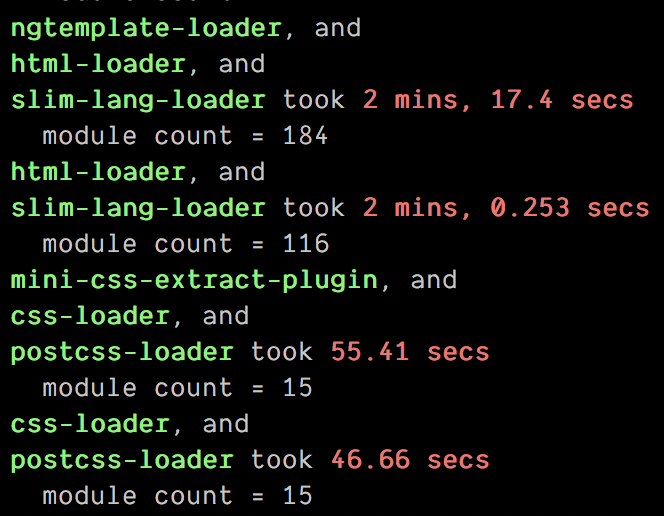
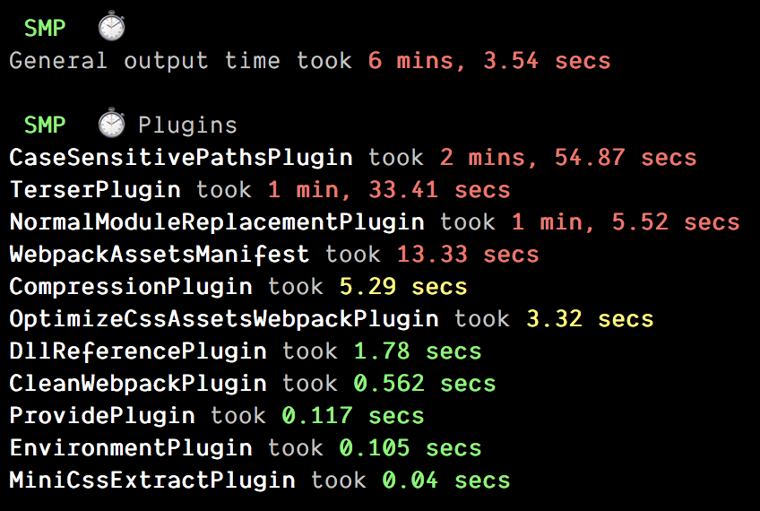
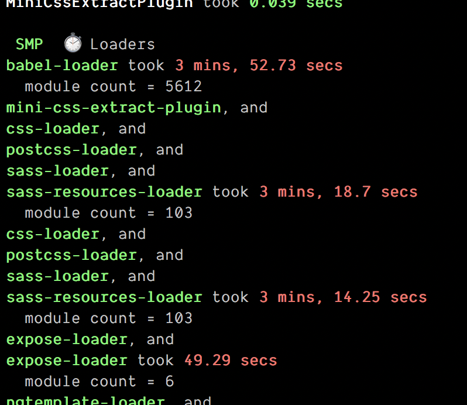

# How to reduce webpack build time by 41.5% with this 1 weird trick

webpack is a really good and extremely flexible tool. How many people can confidently say they built something that supports 99.999999% of weird usecases? It's certainly possible in theory, a naive implementation would be to just pass an "option" parameter and start going wild with the ifs and elses. Now, imagine your option parameter having 1000 attributes, interacting with one another, in an unholy permutation of possibilities. I certainly wouldn't be able to build something nearly maintainable, even if I had the perfect specs beforehand. Not even talking about the plugin architecture, that allows expansion of webpack capabilities without the need to change the core code.

WOW MEME HERE

That being said, and by all the times I had my share of ~~pain~~  learning by navigating in the endless documentation, I realize I still know nothing about it. It's REALLY easy to mess things ups, specially if you don't came from something magic like `create-react-app` or had to eject and do some tweaking to support your use case. Now, if you have an unorthodox config and is struggling to improve your build time, let's talk about it.

You probably visited the [docs guide to perfomance](https://webpack.js.org/guides/build-performance/) (and if you don't speak webpack, you got quite lost, like me 🙃),  [Slack guide to webpack perfomance](https://slack.engineering/keep-webpack-fast-a-field-guide-for-better-build-performance-f56a5995e8f1), [Onfido guide to perfomance](https://medium.com/onfido-tech/speed-up-webpack-ff53c494b89c), and both (like this post) linking to another infinite resources. And  you probably tried measuring things with tools like the [speed-measure-plugin](https://github.com/stephencookdev/speed-measure-webpack-plugin), analysed the results, removed some plugins, changed other configurations, measured again, added another plugin promising that parallelisation would save the day (which they probably didn't, otherwise you wouldn't be here), and ended yet another day frustrated, feeling beaten by your own creation.

FRAKENSTAING MONSTER MEME HERE

But... sometimes the flailing just works.

Measuring first before tweaking perfomance is a must, and since all resources pointed to a common tool, we decided to give it a shot. Speed measure plugin, gave the following scenario:

A quite bloody scenario, with 11 minutes total. But wait... something is weird here. Looking just the plugins metrics, HOW can "CaseSensitivePathsPlugin" be responsible for 5min of our build? A plugin responsible for just ensuring the case sensitivity of my files??? Somethings seems obviously wrong, and before even looking to the rest of the metrics, we decided to tackle it by simply removing it.

COOL! We already managed to reduce 5 min of our build time!!!!!!!! But we actually didn't. Overall output still took the 11 minutes 🙃 We didn't fully understand what happened, so to unblock ourselves we ignored this result and continued to investigate.

The loaders metrics didn't gave much more insight either. Babel-loader was taking 9min to build. Well, with 5.6k TS modules of course it would make babel sweat a little bit, so we just assumed there was nothing much we could do. Next, would be the `sass` preprocessor chain. 6min for just 103 files seems a little too much. Expose loader is weird, I just want my jquery to be globally available, why it's taking 3 minutes? Then comes the `slim` preprocessor part with 2x 2min. 

Obs: Slim is just like `pugjs` but is more commonly used in Rails applications as the main template engine. Since we came from a Rails building system (hello `sprockets` ) before migrating to `webpack` we decided to keep supporting it through the slim-loader loader.  Let's ignore the rest.

Ok, we tried a few other things, including using the parallel plugins options, but none worked out of the box, and that demotivated us harshly. We decided to hold the investigation, since we were out of leads. Basically we just assumed 5.6k TS/JS files + babel were the culprits and there was nothing we could do about it.

Quite sometime later, we discovered that the slim preprocessor was quite under performant.   Maybe using a better implementation (perhaps rewritten in GO 👀) of it would lower the time......... OR MAYBE WE COULD JUST PURGE IT FROM OUR CODEBASE.

The result was like day and night. `webpack-dev-server` just went from a 5 min build to less than a minute. What about the build? 730s → 427s a 41.5 % improvement. BUT HOW?? wasn't slim only responsible for about 4min in our build time? Compared to Babel and Sass, it wasn't that much on the overall time... what was going on? Well, we measured things once again:

There was some weird stuff going on... How come babel-loader only took 4min this time? even sass took less time to build! Whaaaaaat ??

In the end this plugin couldn't give us the main culprit for our huge build time. Maybe it's because the compiler of slim was actually a ruby gem called in a `execSync` node call, and caused the measure plugin to not be so accurate?

## Conclusion

Sorry for the long narrative, It's just that sometimes developing is so frustrating it's funny. 

In the end, we traded the advantages of a modern html syntax like `slim` for a faster build and more pain to maintain our templates (like forgetting to close the div tag ⚰️), but since 90% of those templates were just legacy code and were just slowing down the start of webpack-dev-server, the whole team was absolutely bought in when we reduced the local server build in 80%.

[https://dev.to/sadarshannaiynar/demystifying-webpack-2f5n](https://dev.to/sadarshannaiynar/demystifying-webpack-2f5n)

[https://dev.to/slashgear_/how-to-boost-the-speed-of-your-webpack-build-16h0](https://dev.to/slashgear_/how-to-boost-the-speed-of-your-webpack-build-16h0)

[https://robertknight.me.uk/posts/webpack-dll-plugins/](https://robertknight.me.uk/posts/webpack-dll-plugins/)

[https://github.com/webpack/webpack/issues/1905](https://github.com/webpack/webpack/issues/1905)

[https://slack.engineering/keep-webpack-fast-a-field-guide-for-better-build-performance-f56a5995e8f1](https://slack.engineering/keep-webpack-fast-a-field-guide-for-better-build-performance-f56a5995e8f1)

[https://blog.box.com/how-we-improved-webpack-build-performance-95](https://blog.box.com/how-we-improved-webpack-build-performance-95)

[https://medium.com/onfido-tech/speed-up-webpack-ff53c494b89c](https://medium.com/onfido-tech/speed-up-webpack-ff53c494b89c)

[https://medium.com/ottofellercom/0-100-in-two-seconds-speed-up-webpack-465de691ed4a](https://medium.com/ottofellercom/0-100-in-two-seconds-speed-up-webpack-465de691ed4a)

[https://blog.logrocket.com/guide-performance-optimization-webpack/](https://blog.logrocket.com/guide-performance-optimization-webpack/)
